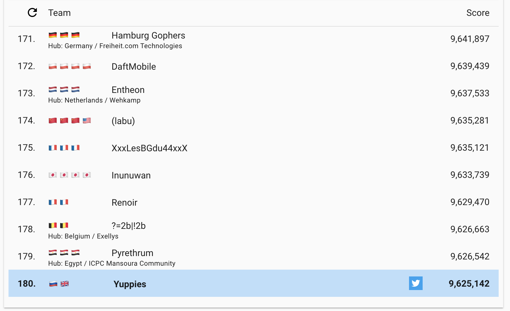
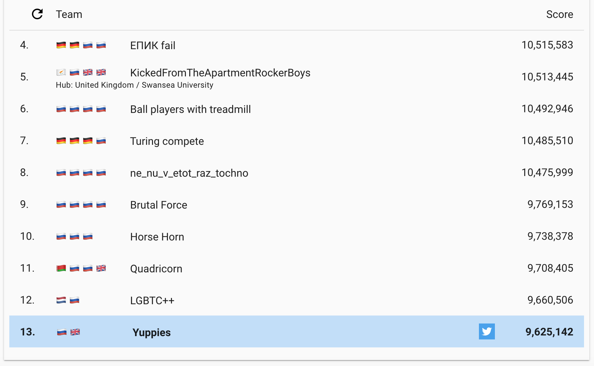

### Extended Run



We are `180/2626` in Extended Run



And we are `13/59` in Russia

## Run C++ code

```bash
$ ./hashcode --input=../../input/a.txt \
             --output=../results/a.txt \
             --attempts=100 \
             --rotations=100
```

## C++ results

|   | Name | Score |
| - | - | - |
| 1 | A – An example | 2 002 |
| 2 | B – By the ocean | 4 567 082 |
| 3 | C – Checkmate | 1 300 268 |
| 4 | D – Daily commute | 1 638 415 |
| 5 | E – Etoile | 723 521 |
| 6 | F – Forever jammed | 1 393 854 |

    Total: 9 625 142 points

## Run C## code:

```shell
$ ./bin/HashCode -i ../input/a.txt -o ./output
```

Required parameters: 
- `-i|--input <input file>` - loads model from the specified file
- `-o|--output <output folder>` - puts the result here

Optional parameter:
- `-v|--verbose` - prints detailed simulation steps

To simply compile and run C# code without publishing:
```shell
$ cd csharp
$ dotnet run -i input.txt -o ./output
```

## C# results

|   | Name | Score |
| - | - | - |
| 1 | A – An example | 2 000 |
| 2 | B – By the ocean | 4 565 916 |
| 3 | C – Checkmate | 1 242 070 |
| 4 | D – Daily commute | 969 685 |
| 5 | E – Etoile | 697 648 |
| 6 | F – Forever jammed | 1 196 271 |

    Total: 8 673 590 points

## Our final score

    Total: 9 625 142 points
