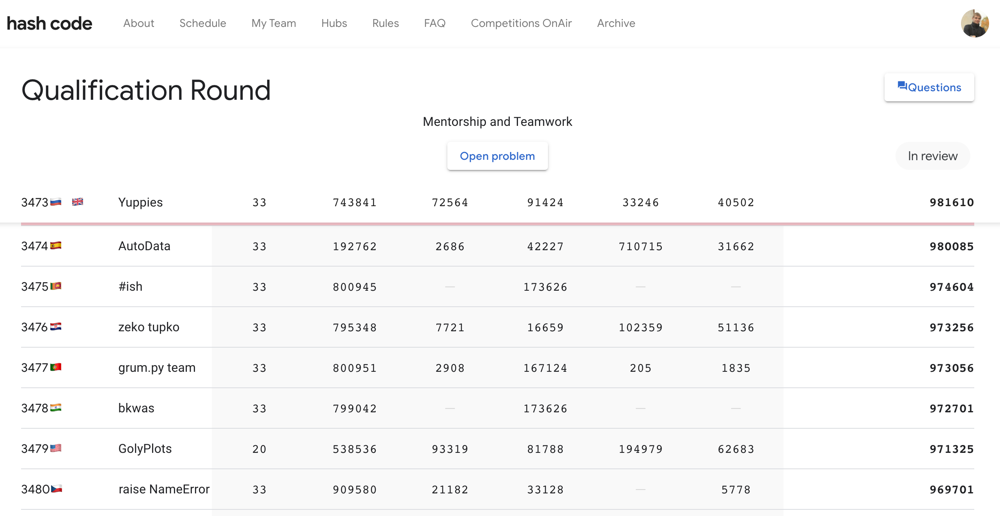

# Qualification Round - Hash Code 2022

We are `3473/9031` in Qualification Round

## Qualification Round C++ results

|   | Name | Score | Top Score |
| - | - | - | - |
| 1 | A – An example | 33 | 33 |
| 2 | B – Better start small | 743 841 | 1 005 020 |
| 3 | C – Collaboration | 72 564 | 288 508 |
| 4 | D – Dense schedule | 91 424 | 674 945 |
| 5 | E – Exceptional skills | 33 246 | 1 650 488 |
| 6 | F – Find great mentors | 40 502 | 1 194 515 |

    Total: 981 610 points (out of 4 813 509)

## Practice mode C++ results (Did not have time to submit during contest 🤷‍♂️)

|   | Name | Score |
| - | - | - |
| 1 | A – An example | 33 |
| 2 | B – Better start small | 743 841 |
| 3 | C – Collaboration | 72 564 |
| 4 | D – Dense schedule | 91 424 |
| 5 | E – Exceptional skills | 1 593 475 |
| 6 | F – Find great mentors | 424 851 |

    Total: 2 926 188 points 🤷‍♂️

## 
