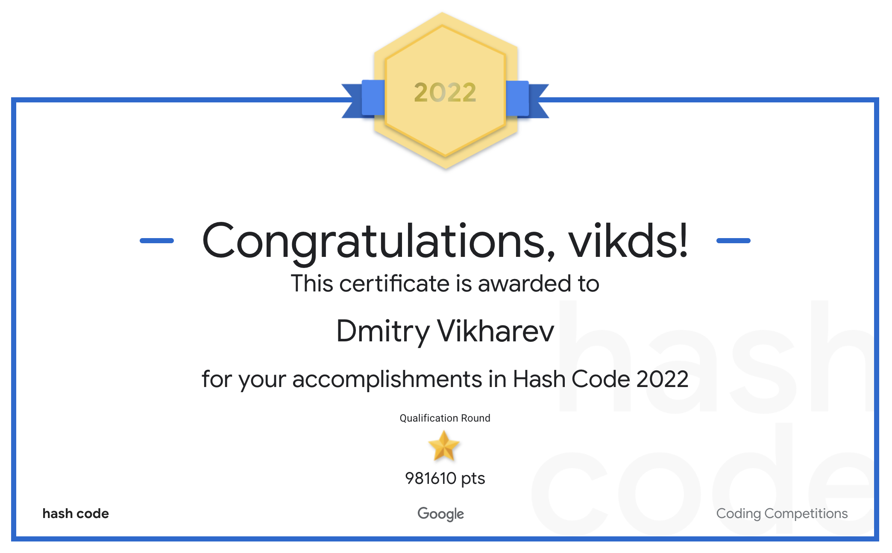
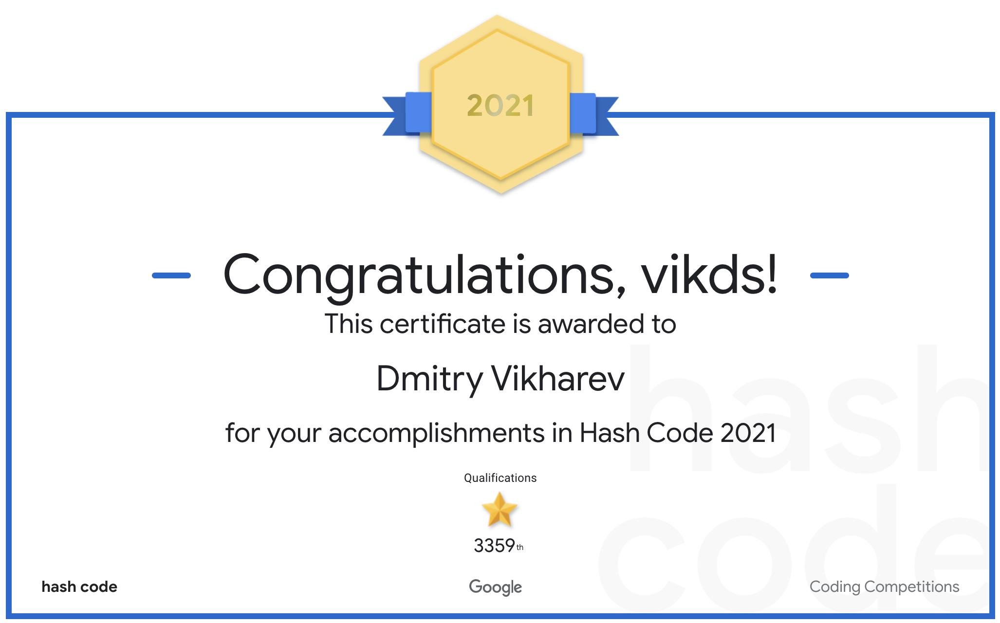

# Google HashCode just for fun

We've taken part in solving Online Qualiffications of Hash Code 2021 problem `"Traffic signaling"` for the first time. Our result was `8 446 233` points, while the best score was `10 586 135` (`3359/9004`).

The second time in solving Online Qualiffications of Hash Code 2022 problem `"Mentorship and Teamwork"` we got almost the same: `981 610` points out of `4 813 509` (`3473/9031`). Just did not have time (about 30 minutes of calculation) to submit 2 good solutions (E, F) during contest 🤷‍♂️.

https://codingcompetitions.withgoogle.com/hashcode/

## Certificate 2022



Result: `3473` / `9031`

[Certificate](https://codingcompetitions.withgoogle.com/hashcode/certificate/summary/00000000008cb4d4)

## Certificate 2021



Result: `3359` / `9004`

[Certificate](https://codingcompetitions.withgoogle.com/hashcode/certificate/summary/0000000000435809)

## C++ requirements

1. [cmake](https://cmake.org/) >= 2.7
2. [C++17](https://en.wikipedia.org/wiki/C%2B%2B17)

## Build C++ code

```bash
$ cd cpp
$ mkdir build
$ cd build
$ cmake ..
...
-- Build files have been written to: ~/hashcode/cpp/build
$ make
...
[100%] Built target hashcode
$ ./hashcode
Usage: ./hashcode [-io] [-i input][-o output] ...
...
```

## C# requirements

[.NET 5.0](https://dotnet.microsoft.com/download/dotnet/5.0) is required to build C# code located in `./csharp` folder.

It's a completely separated version of the solution and not related in any way to a C++ code.

## Building C# code

```shell
$ cd csharp
$ dotnet publish ./HashCode.csproj \
   --output ./bin \
   --configuration Release \
   --runtime linux-x64 \
   -p:GenerateFullPaths=true \
   -p:PublishReadyToRun=true \
   -p:PublishSingleFile=true \
   --self-contained false 
```
